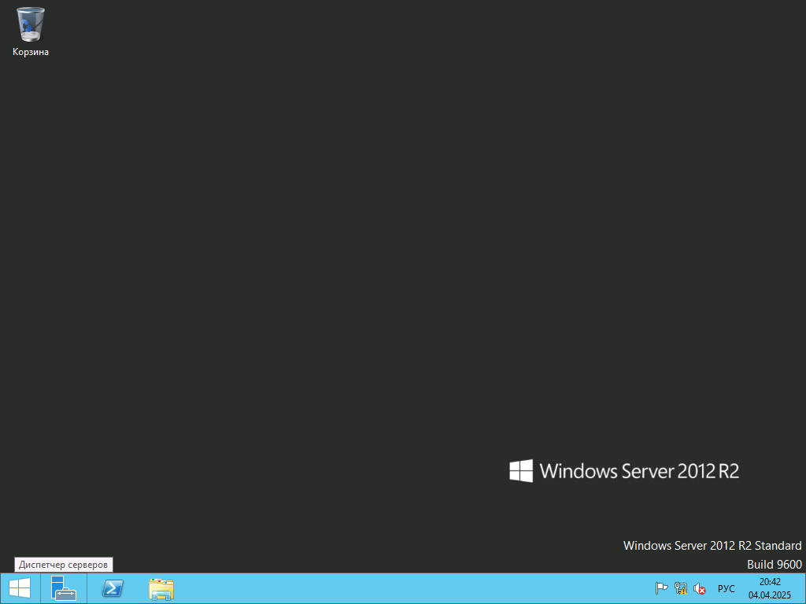
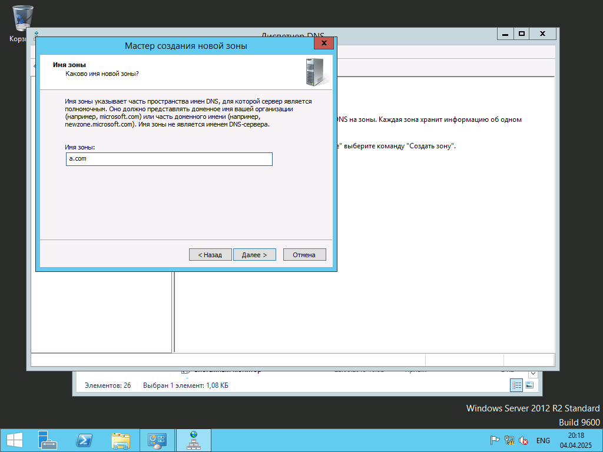
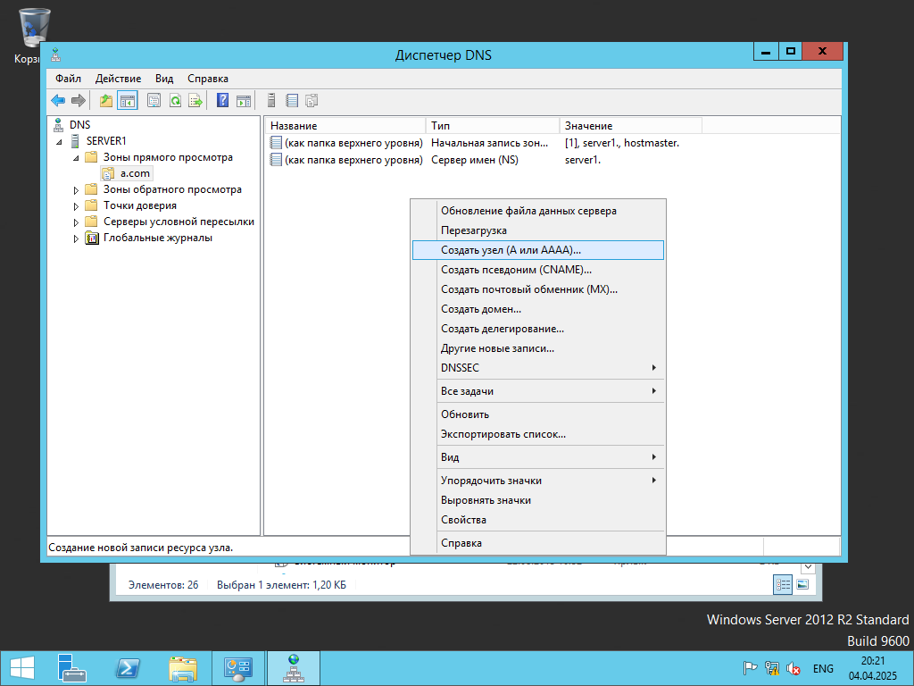
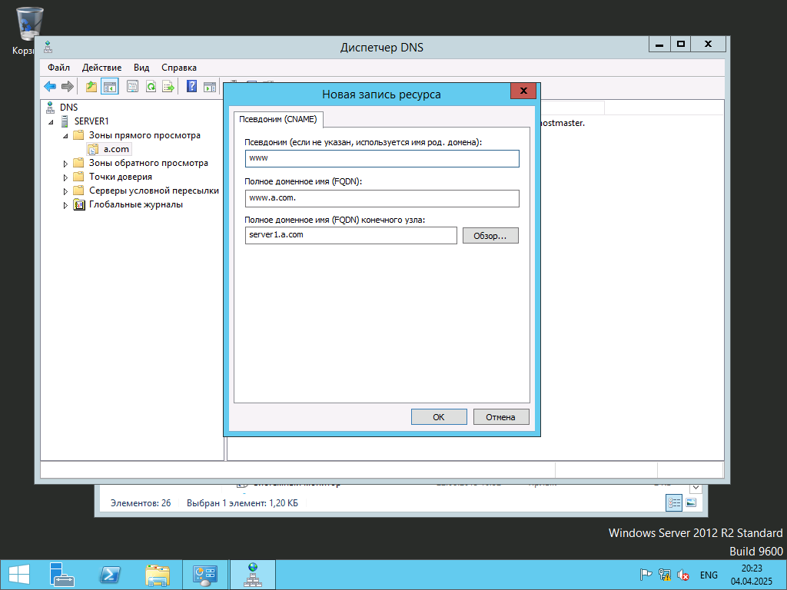

# Лаб.1 DNS

## Установка имени
После установки Windows Server необходимо поменять имя на более "дружелюбное"
Измените его на `server1` следуя этой [инструкции](../set_name/index.md)

## Установка статического IP адреса
Теперь на надо поставить статический IP, это необходимо для работы DNS
Измените настройки интерфейса на следующие по этой [инструкции](../static_ip/index.md)
- IP `11.0.0.1`
- Маска `255.0.0.0`
- DNS1 `11.0.0.1`

## Установка дополнительных компонентов

Сначала необходимо установить необходимые компоненты, а именно
- DNS сервер
- IIS (в качестве HTTP сервера для нашего сайта)

Для этого:

Запустите `Диспетчер серверов`. Справа от меню Пуск (*Значок Windows*)

Нажмите на `Добавить роли и компоненты` и 3 раза `Далее`

Выберите `DNS` и `IIS`, и в поившихся при выборе окнах нажмите `Добавить компоненты`

Потом нажмите 5 раз `Далее` и дождитесь конца установки.

## Настройка DNS
Для работы DNS необходимо настроить де зоны прямую и обратную
- Прямая зона отвечает за конвертацию доменного имени в IP адрес
- Обратная зона отвечает за конвертацию IP адреса имени в доменное имя

Для этого:

Открываем `Администрирование`

Два раза щелкаем по `DNS`

В новом окне, в левой части нажимаем правой кнопкой мыши на `Зоны прямого просмотра` и выбираем `Создать новую зону`

Два раза нажимаем `Далее` и пишем наш домен `a.com`, потом ещё 3 раза `Далее` и нажимаем `Готово`

Два раза кликаем по новой зоне и нажимаем правой кнопкой мыши по пустому месту, затем выбираем `Создать узел (A или AAAA)`

В новом окне в первой строчке вводим имя сервера а в третьей его IP адрес и нажимаем `ОК`

Ещё раз нажимаем правой кнопкой мыши по пустому месту и уже выбираем `Создать псевдоним (CNAME)`

В новом окне в первой строчке вводим `www` а в третьей выбираем IP адрес сервера и нажимаем `ОК`

Теперь создадим обратную зону

В левой части нажимаем правой кнопкой мыши на `Зоны обратного просмотра` и выбираем `Создать новую зону`

Три раза нажимаем `Далее` и пишем первый 3 октета нашего IP адреса. То есть если у нас IP адрес `11.0.0.1` -> его первые три октета это `11.0.0`

Потом нажимаем три раза `Далее` и затем `Готово`

Два раза кликаем по новой зоне и нажимаем правой кнопкой мыши по пустому месту, затем выбираем `Создать указатель`

В новом окне в первой строчке дописываем IP адрес сервера а в третьей выбираем на сервер, и нажимаем `ОК`

### Проверка
На этом настройка DNS сервера закончена, вы можете открыть сайт в браузере на виртуальной машине по адресу www.a.com

## Сдача работы
Для того чтобы сдать эту работу вам нужно ещё одна виртуальная машина.
Вы можете создать ещё одну виртуальную Windows Server или c любой другой версией Windows
После установки Измените данные интерфейса на такие по этому гайду
 - IP 11.0.0.2
 - Маска 255.0.0.0
 - DNS1 11.0.0.1

После этого вы сможете открыть сайт www.a.com c этой виртуальной машины

## Редактирование сайта 
Файлы сайта находятся по этому пути `C:\inetpub\wwwroot`

Для редактирования удалите все файлы в папке, и создайте файл `index.html`. После этого содержимое файла будет отображаться по адресу `www.a.com`