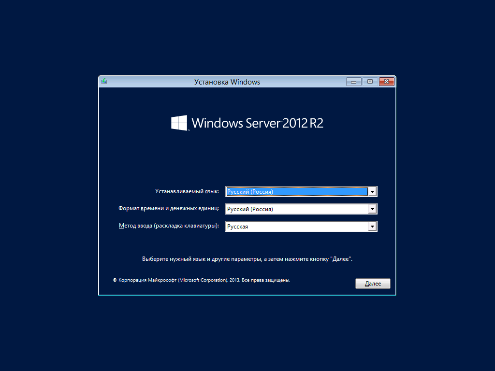

# Установка Windows Server

## Установка

После загрузки, выбираем язык и нажимаем кнопку `Далее`

Нажимаем кнопку `Установить`

Выбираем второй вариант, и соглашаемся с лицензией

Выбираем `Выборочная установка`

Выбираем наше `Незанятое пространство` и нажимаем `☀️Создать`

После того как появятся новый разделы нажимаем `Далее`. Ждем установки

После виртуальная машина перезагрузится и уж там продолжите установку.

##  Настройка

При следующей загрузке, вас попросят установить пароль.

> ⚠️ По умолчанию стоит русская раскладка, не забудьте какой пароль вы ввели

После этого вас отправит на экран входа в систему. Введите пароль который ввели на прошлом этапе.
> ⚠️ Тут тоже по умолчанию стоит русская раскладка

Если у вас появится такое окно, нажмите `Да`

На этом Windows Server установлен