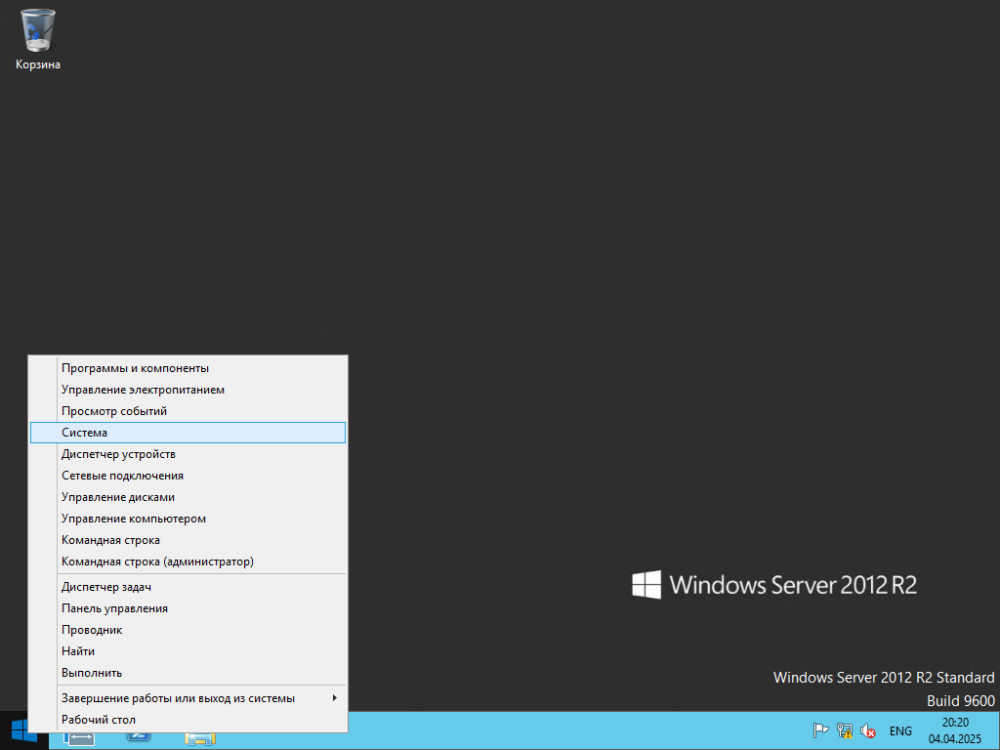
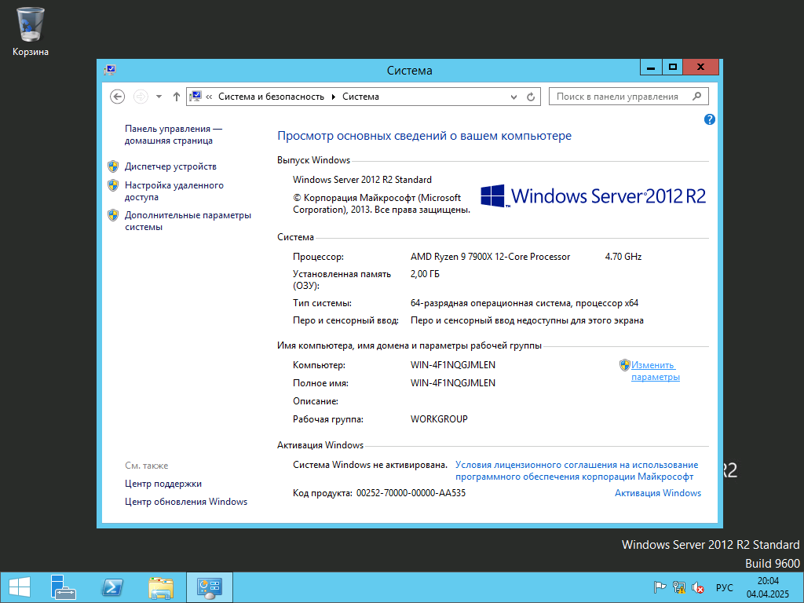
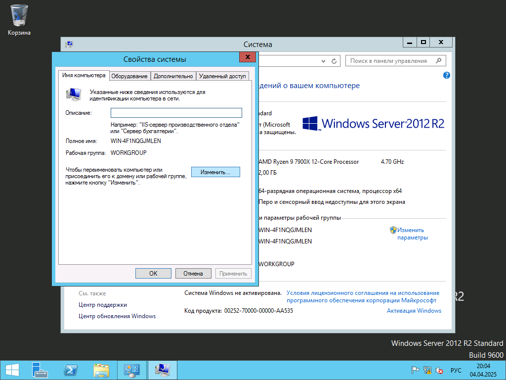
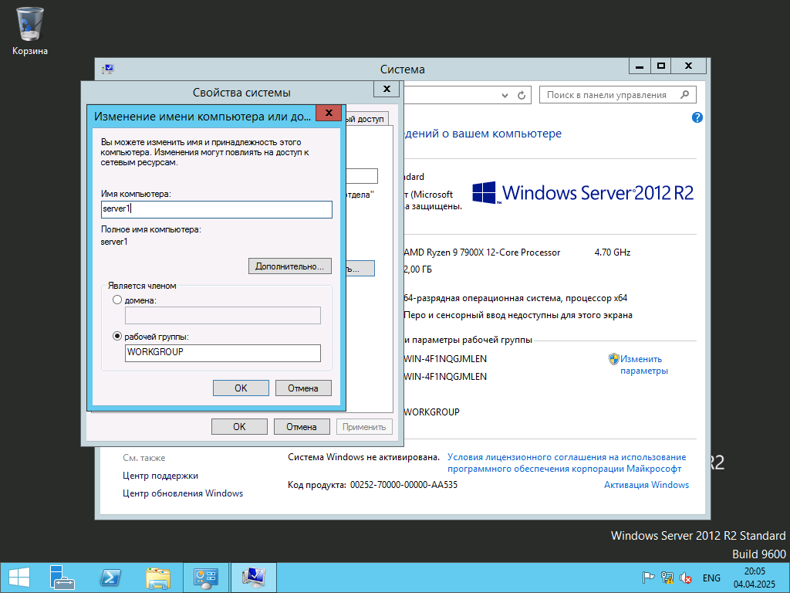

# Установка имени компьютера

Нажимаем правой кнопкой мыши по меню Пуск (*Значок Windows*) и выбираем `Система`

В правой части появившегося окна нажимаем на `Изменить параметры`

Нажимаем кнопку изменить

Меняем имя компьютера, нажимаем `Ок`
После этого необходимо перезагрузить виртуальную машину

