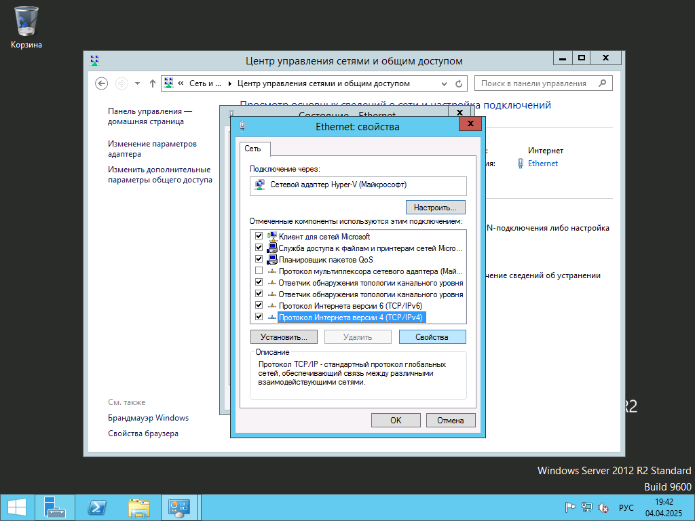

# Установка статического IP и DNS

Нажимаем на меню Пуск (*Значок Windows*) и выбираем `Панель управления`

Далее `Сеть и Интернет`

Далее `Центр управления сетями и общим доступом`

Нажимаем напротив слова `Подключение:` В моём случае это `Ethernet`, у вас может быть другой

Нажимаем `Свойства`

Выбираем `Протокол Интернета версии 4(TCP/IPv4)` и нажимаем свойства

Далее заполняем по строкам
 - Первая строчка IP адрес компьютера
 - Маска сети
 - Шлюз(не обязательно)
 - DNS1
 - DNS2

Можете использовать мои значения, можете писать свои.
